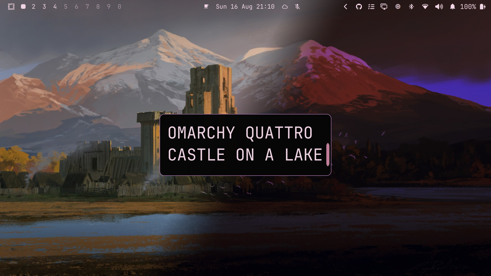

<p align="center">
  
</p>

<h1 align="center">Castle on a Lake</h1>

<p align="center">
  <em>A warm, earthy dark theme for <a href="https://omarchy.org/">Omarchy</a> 4 (Quattro)</em>
</p>

<p align="center">
  <em>#dark · #art-theme · #landscapes · #day-night</em>
</p>

<p align="center">
  
  <a href="#day--night-background-switching"></a>
  <a href="https://opensource.org/licenses/MIT"></a>
  <a href="https://github.com/shmall03/omarchy-castle-on-a-lake-theme"></a>
  <a href="https://github.com/shmall03/omarchy-castle-on-a-lake-theme/fork"></a>
  <a href="https://github.com/shmall03/omarchy-castle-on-a-lake-theme/graphs/contributors"></a>
  <a href="https://github.com/shmall03/omarchy-castle-on-a-lake-theme"></a>
  <a href="https://github.com/shmall03/omarchy-castle-on-a-lake-theme/commits/main"></a>
  <a href="https://github.com/shmall03/omarchy-castle-on-a-lake-theme/releases"></a>
</p>

<p align="center">
  Terracotta accents, cream text, and mossy greens on a near-black canvas — a quiet, old-stone calm.
</p>

---

Named after the four castle images it ships with (two paintings, each in day
and night versions), the theme's palette is blended between its daytime and
nighttime wallpapers so the colors sit naturally against both. And the
background **follows the sun**: it switches itself to the `-night` variant at
sunset and back at sunrise.

## Highlights

- **Day / night auto-switching backgrounds** — the wallpaper follows the sun
  (see [below](#day--night-background-switching))
- **Two castle paintings** by *Raphael Lacoste* — daytime and nighttime
  versions of two scenes
- **Blended palette** — colors mixed between the day and night wallpapers so
  they sit naturally against both
- **Theme-guarded helper** — only acts while this theme is active
- **Whole-desktop coverage** — one `colors.toml` themes the desktop, shell,
  terminals, Neovim, and more

## Day / Night Background Switching

At sunset the background becomes the `-night` variant, and at sunrise it
switches back. The helper looks up real sunrise/sunset times for your location
every day — the location configured for the Omarchy weather panel, or detected
from your IP when none is set.

Install it (safe to re-run, nothing to configure):

```bash
bash ~/.config/omarchy/themes/castle-on-a-lake/daynight/install.sh
```

Remove it:

```bash
bash ~/.config/omarchy/themes/castle-on-a-lake/daynight/uninstall.sh
```

Notes:

- The helper is theme-guarded, so it only changes the background while the
  Castle On A Lake theme is active. A background picked manually via the
  switcher is left untouched.
- Requires network access for the daily sunrise/sunset lookup.
- A `post-boot` hook starts the daemon at login; its log lives at
  `~/.local/state/omarchy/bg-daynight-daemon.log`. Check it's running with
  `pgrep -f bg-daynight-daemon`.

## Installation

```bash
omarchy theme install https://github.com/shmall03/omarchy-castle-on-a-lake-theme.git
```

Or via the menu (**Super + Alt + Space** → **Install > Style > Theme**) — paste
the repo URL and press Enter.

Then apply it:

```bash
omarchy theme set castle-on-a-lake
```

Or pick it under **Style > Theme** in the menu.

## Wallpapers

| Artwork | Daytime | Nighttime |
|:---|:---|:---|
| **Castle on a Lake**<br>*Raphael Lacoste, via [wallhaven.cc/w/ogj6kp](https://wallhaven.cc/w/ogj6kp)* |  |  |
| **Castle in Front of a Mountain**<br>*Raphael Lacoste, via [wallhaven.cc/w/jedy6p](https://wallhaven.cc/w/jedy6p)* |  |  |

*Night versions derived from the originals with [ImageMagick](https://imagemagick.org) and [GIMP](https://www.gimp.org) — dimmer, cooler, moonlit contrast.*

## Color Palette

| Role | Swatch | Hex |
|:---|:---|:---|
| Background |  | `#060606` |
| Dark background |  | `#040404` |
| Lighter background |  | `#1f1f1e` |
| Foreground |  | `#f0d4e4` |
| Accent |  | `#9b6b9f` |
| Muted |  | `#626262` |
| Yellow |  | `#eac283` |
| Orange |  | `#c29176` |
| Green |  | `#d0a46d` |
| Red |  | `#b77e5f` |

## Theme Files

```
colors.toml     Color palette
backgrounds/    Wallpapers (day and night versions)
icons.theme     Yaru-wartybrown icons
daynight/       Day/night background switcher (see above)
preview.jpg     Desktop preview
```

## More from shmall03

**Media Lock Screen** — a companion Omarchy Quattro project that replaces the
built-in lock screen with one showing the currently playing track (MPRIS), a
large clock, and your user name, with separate password and fingerprint PAM
flows.

```bash
omarchy plugin add https://github.com/shmall03/omarchy-shmall.lock-plugin.git --enable
```

- [GitHub repo](https://github.com/shmall03/omarchy-shmall.lock-plugin)
- [omarchyplugins.com listing](https://omarchyplugins.com/plugin.html?id=shmall.lock)

## Contributing

Bugs, ideas, and tweaks are welcome — open an
[issue](https://github.com/shmall03/omarchy-castle-on-a-lake-theme/issues) or
[pull request](https://github.com/shmall03/omarchy-castle-on-a-lake-theme/pulls).

## License

The theme code — the color palette, icon config, day/night switcher scripts,
and all other files except the artwork — is released under the
[MIT License](LICENSE), Copyright (c) 2026 Ben Smith.

The bundled wallpapers are digital paintings by
[Raphael Lacoste](https://www.artstation.com/raphael-lacoste), as tagged and
source-linked on [Wallhaven](https://wallhaven.cc). Per Wallhaven, *"all
images remain property of their original owners"* — they are **not** covered
by the MIT license and are included only for use with this theme. The night
versions are derivative edits made with [ImageMagick](https://imagemagick.org)
and [GIMP](https://www.gimp.org) and carry no separate license.

Redistributing the artwork, including the night versions, or creating further
derivatives requires the artist's permission. If you are the rights holder
and would like these images removed, open an issue and they will be taken
down.

## Acknowledgments

- [Raphael Lacoste](https://www.artstation.com/raphael-lacoste) — artist of
  the bundled wallpapers, as tagged and source-linked on
  [Wallhaven](https://wallhaven.cc)
  ([ogj6kp](https://wallhaven.cc/w/ogj6kp), [jedy6p](https://wallhaven.cc/w/jedy6p))
- [Aether](https://github.com/bjarneo/aether) — color palette generation
- [Omarchy](https://omarchy.org/) — the desktop this theme was made for
