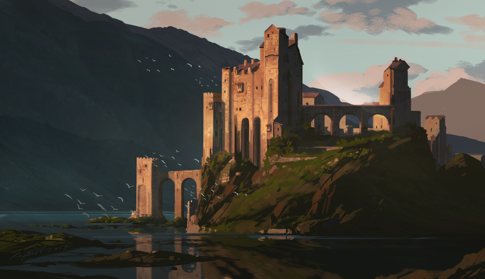
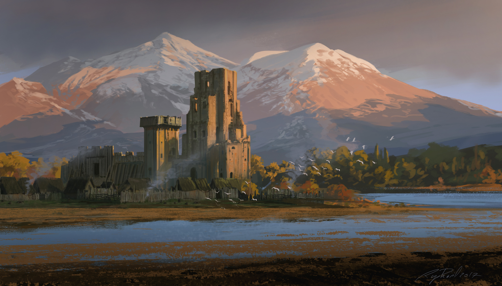
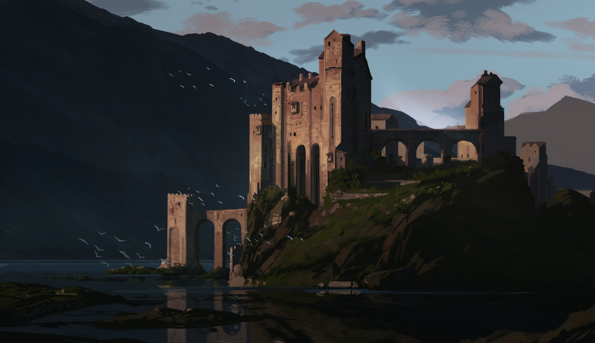
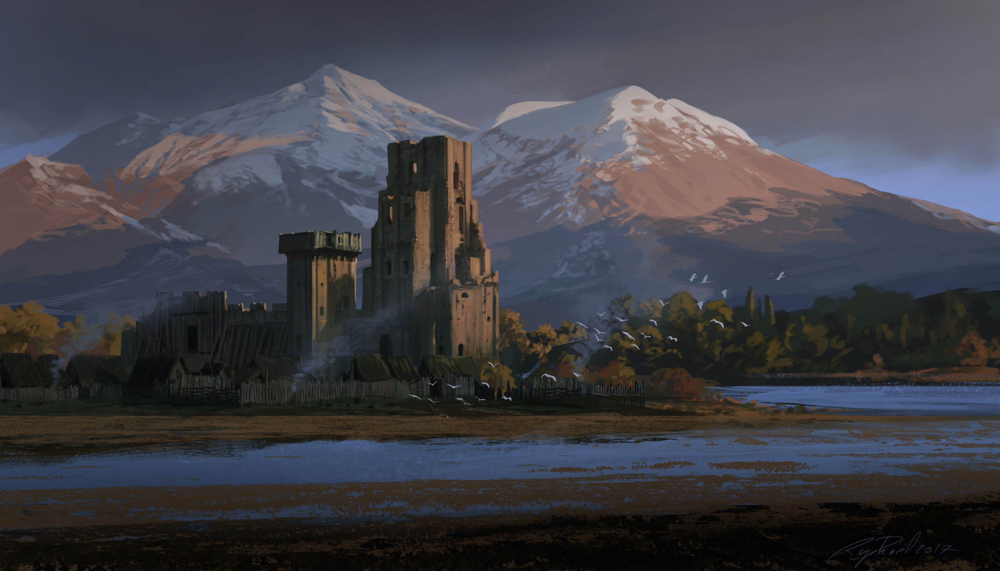

# Castle on a Lake — Omarchy (Quattro) Theme

A warm, earthy dark theme for [Omarchy](https://omarchy.org/) 4 (Quattro),
named after the four castle paintings it ships with (daytime and nighttime
versions). Terracotta accents,
cream text, and mossy greens rest on a near-black canvas for a quiet,
old-stone kind of calm.

## Wallpapers



*Digital painting by **Raphael Lacoste** — [wallhaven.cc/w/ogj6kp](https://wallhaven.cc/w/ogj6kp)*



*Digital painting by **Raphael Lacoste** — [wallhaven.cc/w/jedy6p](https://wallhaven.cc/w/jedy6p)*

### Night versions



*Night version derived from the original with ImageMagick (dimmer, cooler, moonlit contrast).*



*Night version derived from the original with ImageMagick (dimmer, cooler, moonlit contrast).*

## Color Palette

| Role | Swatch | Hex |
|:---|:---|:---|
| Background |  | `#070804` |
| Dark background |  | `#050603` |
| Lighter background |  | `#20211d` |
| Foreground |  | `#E1D2C8` |
| Accent |  | `#ad6d60` |
| Muted |  | `#5d5f58` |
| Yellow |  | `#ffec9a` |
| Orange |  | `#c39d7b` |
| Green |  | `#d9c17b` |
| Red |  | `#b88c64` |

## Installation

```bash
omarchy-theme-install https://github.com/shmall03/omarchy-castle-on-a-lake-theme.git
```

## Theme Files

```
colors.toml     Color palette
backgrounds/    Wallpapers
icons.theme     Yaru-wartybrown icons
```

## Acknowledgments

- [Raphael Lacoste](https://www.artstation.com/raphael-lacoste) — original
  artwork for the included wallpapers ([ogj6kp](https://wallhaven.cc/w/ogj6kp),
  [jedy6p](https://wallhaven.cc/w/jedy6p)) via [Wallhaven](https://wallhaven.cc)
- [Aether](https://github.com/bjarneo/aether) — color palette generation
- [Omarchy](https://omarchy.org/) — the desktop this theme was made for
